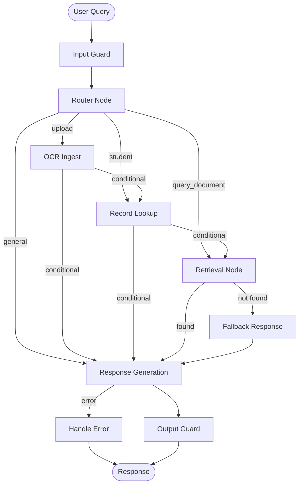
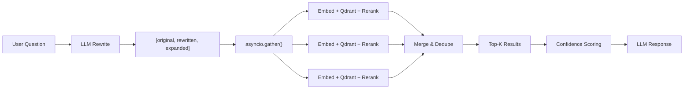

# PASsistant — Academic Services & Student Records Chatbot

A **LangGraph-powered RAG chatbot** for Universitas Pasundan's Faculty of Engineering that answers student questions about **academic policies**, **curriculum**, and **student records**. Features document OCR ingestion, vector indexing, hybrid retrieval (dense + BM25) with cross-encoder reranking, and GLM-OCR for PDF ingestion.

---

## Table of Contents

- [Features](#features)
- [Architecture](#architecture)
- [Quick Start](#quick-start)
- [API Endpoints](#api-endpoints)
- [Document Management](#document-management)
- [Evaluation](#evaluation)
- [Environment Variables](#environment-variables)
- [Development](#development)
- [Documentation](#documentation)
- [Tech Stack](#tech-stack)

---

## Table of Contents

- [Features](#features)
- [Architecture](#architecture)
- [Quick Start](#quick-start)
- [API Endpoints](#api-endpoints)
- [Document Management](#document-management)
- [Evaluation](#evaluation)
- [Environment Variables](#environment-variables)
- [Development](#development)
- [Project Structure](#project-structure)
- [Documentation](#documentation)
- [Tech Stack](#tech-stack)
- [License](#license)

---

## Features

- **Document Indexing** — Uploaded documents are OCR-processed and indexed for retrieval with document type classification (10 types)
- **Contextual Embeddings** — Indexed text can include document-level context for better semantic matching
- **Hybrid Retrieval** — Dense vector search + BM25 sparse vectors fused with RRF, or cross-encoder reranking
- **Confidence Scoring** — Custom 5-component confidence model to rank and validate answers
- **GLM-OCR** — PDF documents are parsed page-by-page with layout-aware OCR preserving table structure
- **Multi-query Expansion** — Queries are rewritten and expanded (including semester numeral normalization) for higher recall
- **Guardrails** — Input injection detection + output PII masking + system prompt leak prevention
- **RAGAS Evaluation** — Automated RAG quality assessment with Faithfulness, Answer Relevancy, Context Precision, and Context Recall
- **Session Management** — In-memory session tracking for continuous conversations
- **Rate Limiting** — In-memory rolling window rate limiting per IP
- **Multi-channel** — REST API, WebSocket streaming (with SSE resume via `Last-Event-ID`), and Telegram bot integration (including photo/image uploads)

---

## Architecture



**Retrieval Pipeline Detail:**



---

## Quick Start

### Prerequisites

- Python 3.11+
- [UV](https://docs.astral.sh/uv/getting-started/installation/) package manager
- Docker (for Qdrant & Redis)
- API keys: OpenAI-compatible provider (e.g. OpenRouter), Zhipu AI (GLM-4 OCR)

### Setup

```bash
git clone <repo-url>
cd PASsistant

# Install dependencies
uv sync --dev

# Configure environment
cp .env.example .env
# Edit .env with your API keys
```

### Run Infrastructure

```bash
# Qdrant vector database
docker run -p 6333:6333 -p 6334:6334 \
  -v $(pwd)/qdrant_storage:/qdrant/storage \
  qdrant/qdrant

# Redis (optional, for caching)
docker run -p 6379:6379 redis:7-alpine
```

### Launch

```bash
# REST API server
uv run uvicorn src.api:app --reload --port 8000

# Telegram bot (polling mode for dev)
uv run python -m src.telegram_bot.polling
```

### Ingest Documents

```bash
curl -X POST http://localhost:8000/upload \
  -F "files=@Kurikulum_IF_2021.pdf" \
  -F "files=@Buku_Panduan_Akademik.pdf"
```

---

## API Endpoints

| Method | Endpoint | Description |
|--------|----------|-------------|
| `GET` | `/health` | Health check (Qdrant + Redis status) |
| `GET` | `/documents` | List ingested documents |
| `DELETE` | `/documents/by-filename/{filename}` | Delete a document from index |
| `POST` | `/upload` | Upload and ingest documents |
| `POST` | `/chat` | Send a chat message |
| `POST` | `/chat/upload` | Chat with file attachment |
| `POST` | `/chat/stream` | Streaming chat (SSE) |
| `POST` | `/chat/upload/stream` | Streaming chat with file |
| `POST` | `/telegram/webhook` | Telegram webhook receiver |
| `GET` | `/telegram/webhook` | Telegram webhook health/status check |
| `WS` | `/ws/{thread_id}` | WebSocket streaming |

---

## Document Management

```bash
# List all ingested documents
curl http://localhost:8000/documents

# Delete a specific document (re-ingest after pipeline changes)
curl -X DELETE "http://localhost:8000/documents/by-filename/Kurikulum%20IF%202021.pdf"

# Re-upload
curl -X POST http://localhost:8000/upload -F "files=@Kurikulum_IF_2021.pdf"
```

---

## Evaluation

Run RAGAS evaluation to measure retrieval and generation quality:

```bash
# Live evaluation against current index
uv run python -m src.eval.ragas \
    --dataset tests/fixtures/ragas_dataset.jsonl \
    --mode live

# From pre-computed fixtures (no API calls for pipeline)
uv run python -m src.eval.ragas \
    --dataset tests/fixtures/ragas_dataset.jsonl \
    --mode fixture
```

See [docs/evaluation.md](docs/evaluation.md) for full evaluation guide.

---

## Environment Variables

See [`.env.example`](.env.example) for all available variables. Key ones:

| Variable | Description |
|----------|-------------|
| `OPENAI_API_KEY` | LLM provider API key (OpenRouter, OpenAI, etc.) |
| `OPENAI_BASE_URL` | LLM provider base URL |
| `LLM_MODEL` | Primary LLM model for responses |
| `LLM_REASONING_ENABLED` | Enable/disable provider reasoning controls |
| `EMBEDDING_MODEL` | Embedding model for vector search |
| `VECTOR_SIZE` | Dimensions of the embedding model |
| `ZHIPU_API_KEY` | Zhipu AI key for GLM-4 OCR |
| `QDRANT_URL` | Qdrant vector database URL |
| `RETRIEVAL_STRATEGY` | `similarity`, `rrf`, or `reranker` |
| `RETRIEVAL_TOP_K` | Number of chunks retrieved per query |
| `RERANKER_MODEL` | Cross-encoder model (when strategy=reranker) |
| `TELEGRAM_BOT_TOKEN` | Telegram bot token |
| `TELEGRAM_WEBHOOK_URL` | Target URL for Telegram webhook |
| `TELEGRAM_WEBHOOK_SECRET_TOKEN` | Secret token to authenticate webhook requests |
| `CORS_ALLOWED_ORIGINS` | Allowed origins for API requests |
| `RATE_LIMIT_PER_MINUTE` | Request limit per IP per minute |

---

## Development

```bash
# Run all tests
uv run pytest

# Run specific test suite
uv run pytest tests/test_prod_readiness.py -v

# Format & lint
uv run ruff format .
uv run ruff check .

# Type check
uv run basedpyright src/
```

### Helper Scripts

```bash
bash scripts/setup.sh                  # Full project setup
bash scripts/run_qdrant.sh             # Launch Qdrant via Docker
python scripts/build_ragas_dataset.py  # Validate eval dataset
```

---

## Project Structure

<details>
<summary>Click to expand</summary>

```text
src/
├── agent.py                 # LangGraph app entry point
├── api/                     # FastAPI REST + WebSocket layer
│   ├── routes/              # Endpoint handlers
│   ├── models.py            # Pydantic schemas
│   ├── services.py          # API orchestration
│   └── sessions.py          # In-memory session manager
├── config/                  # Pydantic settings and structured logging
├── eval/                    # RAGAS evaluation framework
├── graphs/                  # LangGraph workflow definition
├── guardrails/              # Input/output safety filters & rate limiting
├── services/                # Business logic (intent, response, indexing)
├── telegram_bot/            # Telegram integration (webhook + polling)
└── utils/
    ├── cache.py             # Redis integration
    ├── state.py             # Core data models
    ├── nodes/               # LangGraph node implementations
    ├── tools/               # OCR, student, and vector-store tools
    └── vector_store/        # Qdrant operations
```

</details>

---

## Documentation

| Document | Description |
|----------|-------------|
| [docs/architecture.md](docs/architecture.md) | System architecture and pipeline design |
| [docs/retrieval-pipeline.md](docs/retrieval-pipeline.md) | Retrieval strategy and indexing details |
| [docs/evaluation.md](docs/evaluation.md) | RAGAS evaluation guide |
| [docs/deployment.md](docs/deployment.md) | Deployment and infrastructure guide |

---

## Tech Stack

| Component | Technology |
|-----------|------------|
| Agent Framework | LangGraph |
| LLM | OpenAI-compatible (DeepSeek, GPT-4o, Claude, etc.) |
| OCR | GLM-4 Vision (Zhipu AI) |
| Vector DB | Qdrant (dense + sparse vectors) |
| Embeddings | Configurable (Qwen, OpenAI, etc.) |
| Reranker | Jina Reranker v2 / FastEmbed cross-encoder |
| API | FastAPI + Uvicorn |
| Caching | Redis |
| Guardrails | Input/Output Guards |
| Security | In-memory Rate Limiting |
| Observability | LangSmith, RFC 5424 Structured Logging |
| Evaluation | RAGAS 0.4.3 |
| Package Manager | UV |

---

## License

MIT
