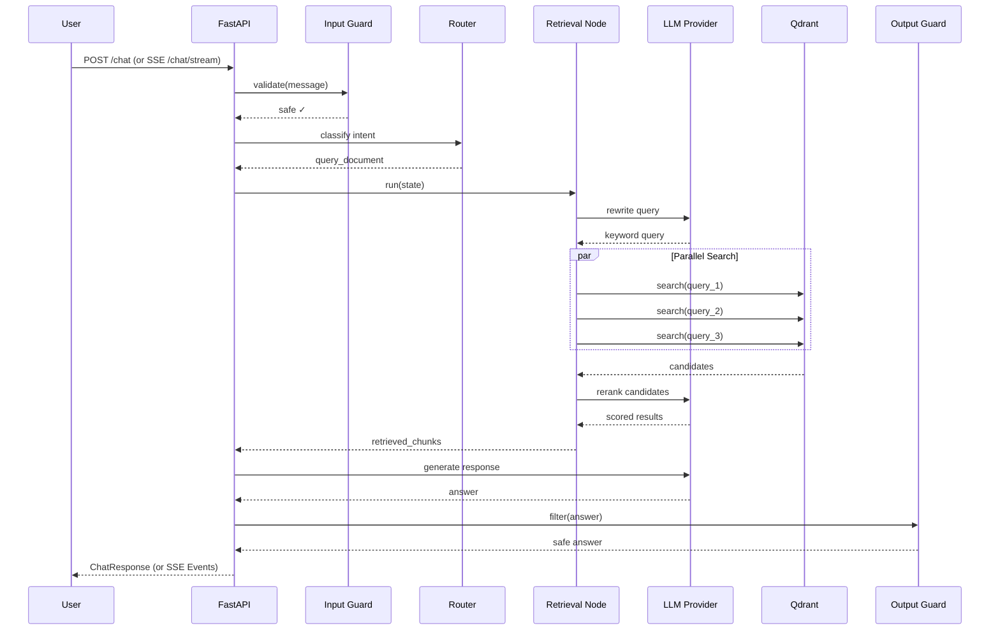

# Architecture

## System Overview

PASsistant is a Retrieval-Augmented Generation (RAG) chatbot built on LangGraph. It processes academic documents (PDF) through OCR, indexes them into a vector database, and answers student questions by retrieving relevant context and generating grounded responses.

## Component Diagram

```mermaid
flowchart TB
    subgraph API["API Layer"]
        FastAPI[FastAPI REST + WebSocket (SSE Support)]
        Telegram[Telegram Bot Adapter]
    end

    subgraph Graph["LangGraph Workflow"]
        Router[Router Node]
        Retrieval[Retrieval Node]
        Response[Response Node]
        Fallback[Fallback Response Node]
        ErrorNode[Error Handler Node]
        OutputGuard[Output Guard]
        DocProcessor[Document Processor]
        StudentHandler[Student Record Handler]
    end

    subgraph Services["Service Layer"]
        Intent[IntentClassifier]
        ResponseGen[ResponseGeneration]
        DocProcessing[DocumentProcessing]
        IngestionHealth[IngestionHealth]
        Sessions[InMemorySessionManager]
        RateLimit[InMemoryRateLimiter]
    end

    subgraph Infra["Infrastructure"]
        Qdrant[(Qdrant)]
        Redis[(Redis Cache)]
        LLM[OpenAI / OpenRouter]
        Zhipu[Zhipu AI GLM-4 OCR]
    end

    API --> Graph
    Graph --> Services
    Services --> Infra
```

## Request Lifecycle



## SSE Streaming Support

The FastAPI layer supports streaming interactions via Server-Sent Events (SSE). It emits 5 event types during a run:
1. `run.started`
2. `run.status`
3. `message.delta`
4. `run.completed`
5. `run.failed`

It also supports seamless resumption using the `Last-Event-ID` header or query parameter.

## Key Design Decisions

### Chunked Document Indexing

Documents are OCR-processed and split into overlapping chunks using LangChain's
`RecursiveCharacterTextSplitter`. Each chunk is embedded and upserted into Qdrant
with page-number metadata derived from OCR page boundaries, enabling page-level
citations in retrieval results.

### Contextual Embedding

Each chunk payload includes document-level metadata (`doc_title`, `filename`,
`document_type`) and page-level `source_locations`, keeping broad context
available to semantic search and enabling accurate citations.

### Hybrid Retrieval with Reranking

Three retrieval strategies are supported:
- **similarity** — Dense cosine similarity only
- **rrf** — Reciprocal Rank Fusion of dense + BM25 sparse vectors
- **reranker** — First-stage RRF/similarity candidates re-scored by a cross-encoder

### Parallel Multi-Query

Up to 3 query variants (original, LLM-rewritten, expanded) are searched in parallel via `asyncio.gather`, reducing retrieval latency from 3x to 1x the single-query time.
