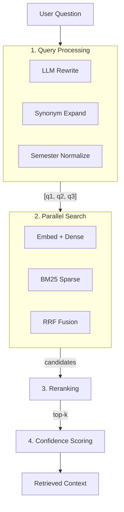
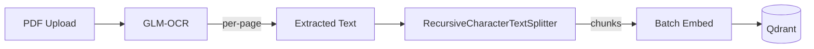

# Retrieval Pipeline

## Overview

The retrieval pipeline transforms a user question into relevant document context through multiple stages: query processing, vector search, result ranking, and confidence scoring.

## Pipeline Stages

## 1. Query Processing

### Multi-Query Generation

For `query_document` intent, up to 3 query variants are generated:

| Variant | Source | Example |
|---------|--------|---------|
| Original | User input | "Kak, kalau aku telat bayar DPP, bisa ikut perwalian?" |
| Rewritten | LLM compression | "syarat perwalian pembayaran DPP" |
| Expanded | Synonym + normalization | "syarat perwalian pembayaran DPP" (with semester normalization) |

### Semester Numeral Normalization

Documents use Roman numerals ("Semester V") while users often type Arabic ("semester 5"). The query expander converts between formats:

- "semester 5" → "semester V" (for matching document headings)
- "semester V" → "semester 5" (for matching informal text)

### Synonym Expansion

Domain-specific Indonesian academic synonyms:
- "absen" → "ketidakhadiran"
- "tidak aktif" → "nonaktif"
- "cuti" → "cuti akademik"
- "drop out" → "dikeluarkan"

## 2. Ingestion Pipeline

### Document Processing Flow

### Chunked Indexing with RecursiveCharacterTextSplitter

Each ingested document is split into overlapping chunks using LangChain's
`RecursiveCharacterTextSplitter`. The splitter tries separators in order
(`\n\n`, `\n`, `. `, ` `, `""`) to find natural break points.

| Parameter | Default | Env Var |
|-----------|---------|---------|
| Chunk size | 1000 chars | `CHUNK_SIZE` |
| Chunk overlap | 200 chars | `CHUNK_OVERLAP` |
| Separators | `["\n\n", "\n", ". ", " ", ""]` | `CHUNK_SEPARATORS` |

Each chunk carries:
- `chunk_id` — `{document_id}:chunk:{index}`
- `text` — the chunk content
- `document_id`, `filename`, `doc_title`, `document_type`
- `chunk_type` — `"chunk"`
- `chunk_index` — zero-based position in the document
- `source_locations` — list of `{"page": N}` objects (1-based page numbers
  derived from OCR page boundaries)

### Page Number Tracking

Page numbers are reconstructed from per-page OCR text lengths stored in
`DocumentUpload.ocr_page_status`. Each chunk's character span is mapped
against page boundaries so that chunks spanning multiple pages carry all
relevant page numbers.

### Embedding and Indexing

Chunks are embedded in batches (32 at a time by default) using the
configured embedding model. When hybrid retrieval (`rrf` or `reranker`)
is active, a BM25 sparse vector is also generated for each chunk.
All vectors and metadata are upserted into Qdrant as individual points.

### Cache Invalidation

On each document indexing:
1. **Blanket invalidation** — all cached search results are cleared
   (`delete_prefix("search:")`).
2. **Per-document invalidation** — any cache entries scoped to the
   specific document ID are also removed (`delete_prefix("doc:{id}:")`).

## 3. Search Strategies

### Pure Similarity (`RETRIEVAL_STRATEGY=similarity`)

- Dense cosine similarity only
- `score_threshold=0.2` minimum
- Candidate multiplier: 3x top_k

### RRF Hybrid (`RETRIEVAL_STRATEGY=rrf`)

- Dense + BM25 sparse vectors searched independently
- Fused with Reciprocal Rank Fusion (k=60)
- No absolute score threshold (relative filtering at 50% of top score)
- BM25 uses `Qdrant/bm25` model with stemmer enabled

### Reranker (`RETRIEVAL_STRATEGY=reranker`)

- First stage: same as RRF or similarity (wider candidate pool, 6x multiplier)
- Second stage: cross-encoder reranker scores each candidate (OpenRouter provider primary, with automatic Jina AI fallback)
- Final threshold: score > 0.0

### Score Fields

- `retrieval_score` is the first-stage vector similarity or RRF score.
- `reranker_score` is present only when reranker mode scores the chunk.
- `final_score` is the final confidence score computed by the Confidence Scoring stage.

## 4. Confidence Scoring

A custom 5-component model evaluates the final retrieved context to assign a confidence level (High, Medium, Low) and determine if an honest fallback is required:
1. **Score Magnitude**: Checks if the top chunk's final score passes a baseline threshold.
2. **Margin**: Compares the top chunk to the rest to ensure it strongly stands out.
3. **Overlap**: Checks if semantic overlap across top results confirms the answer.
4. **Strong Hits**: Counts how many chunks cross a "strong" relevance threshold.
5. **Explicit Policy Rules**: Detects if the query relates to rigid academic rules and ensures policy documents are retrieved.

## 5. Configuration

| Parameter | Default | Description |
|-----------|---------|-------------|
| `RETRIEVAL_TOP_K` | 10 | Final number of retrieval records returned |
| `RETRIEVAL_STRATEGY` | reranker | Ranking strategy |
| `RERANKER_CANDIDATE_MULTIPLIER` | 6 | First-stage overfetch ratio |
| `CHUNK_SIZE` | 1000 | Target character length per chunk |
| `CHUNK_OVERLAP` | 200 | Character overlap between consecutive chunks |

## 6. Caching

Search results are cached in Redis with key based on:
- Query text
- Document type filter
- Top-k and score threshold
- Retrieval strategy and reranker config
- BM25 settings

Cache is automatically invalidated on document ingestion or deletion (`delete_prefix("search:")`).
Per-document cache entries are also cleared on re-ingestion (`delete_prefix("doc:{id}:")`).
